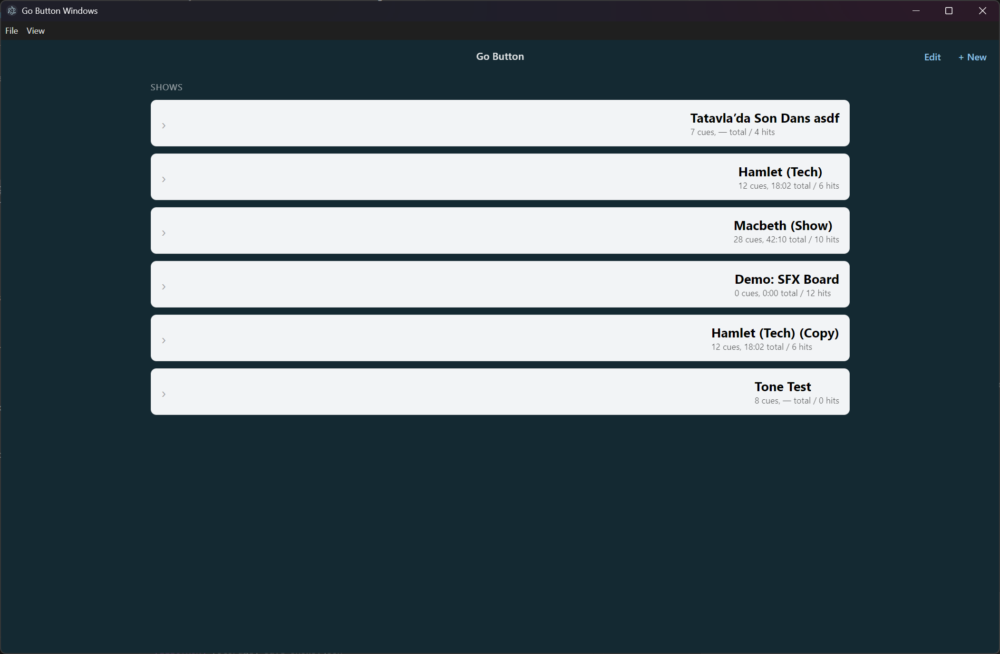
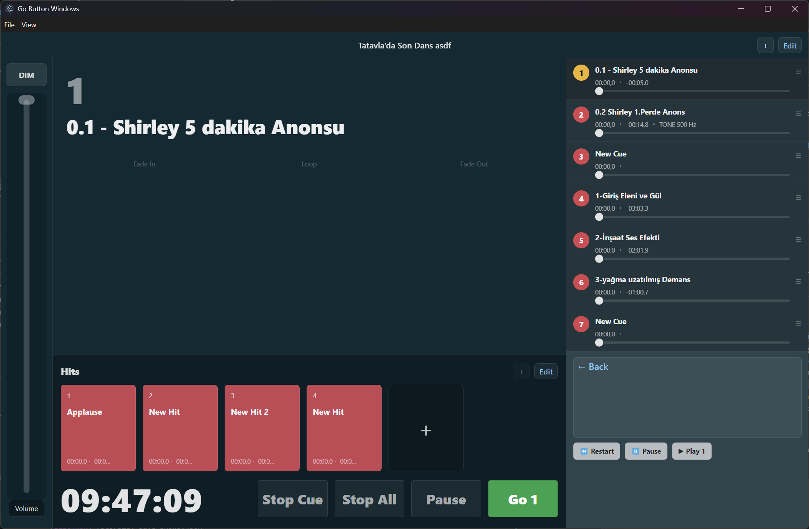
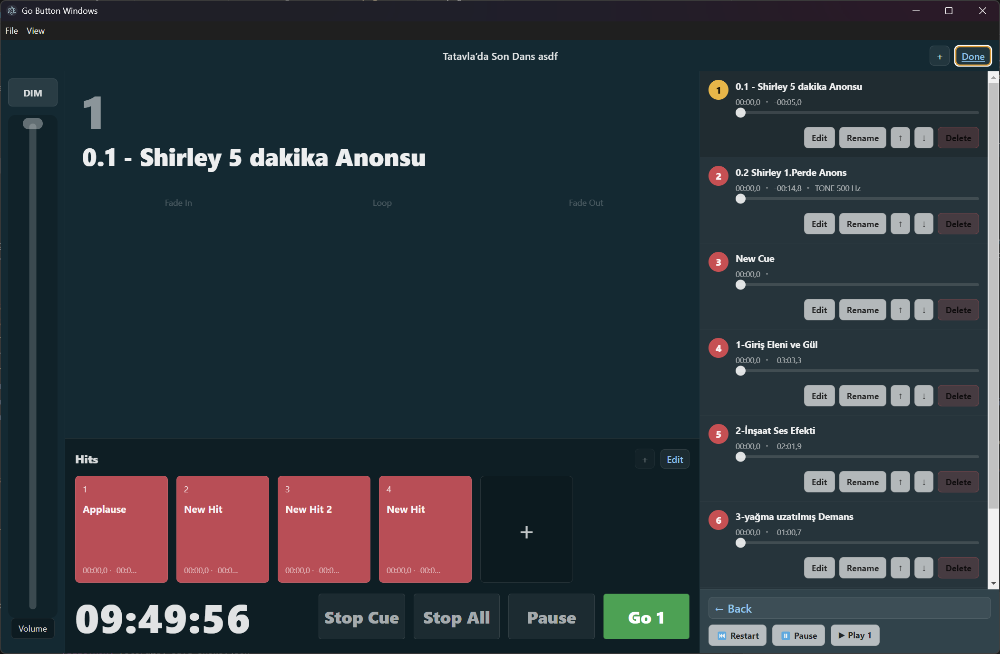

# Go Button Windows (UI prototype)

This repo is an Electron + React UI scaffold for a theatre sound cue / soundboard app.

## Screenshots

## How to run (Windows)
- Install dependencies: `npm install`
- Start the app (dev): `npm run dev`

Notes:
- Show data is saved to a local `shows.json` under the Electron userData folder.
	Use the app menu: **File → Open Data Folder**.
- Cues and hits can overlap (simultaneous playback).
- MP3 and WAV are supported (via Chromium/WebAudio decode).

## Laptop Remote Control (LAN)
The app starts a small HTTP server on the Windows box so you can control GO/Stop from another device on the same network.

- Make sure both devices are on the same LAN (Wi‑Fi/Ethernet).
- Start the app on the Windows box.
- On the laptop, open:
  - `http://<windows-ip>:17832/`

Windows may show a Firewall prompt the first time—allow it on your private network.

## Dev
- Install: `npm install`
- Run: `npm run dev`

## Build (Windows 11 / NUC)
- Build web + Electron bundles: `npm run build`
- Create an installer (NSIS) under `release/`: `npm run dist`
- Create an unpacked folder build under `release/` (useful for quick testing): `npm run pack`

## Build installer (NSIS)
- Run: `npm run dist`
- Output:
	- Installer: `release/Go Button Windows Setup <version>.exe`
	- Unpacked folder: `release/win-unpacked/`

## Status
- Iteration 1 UI only: Shows screen + Show Run screen with seeded data.
